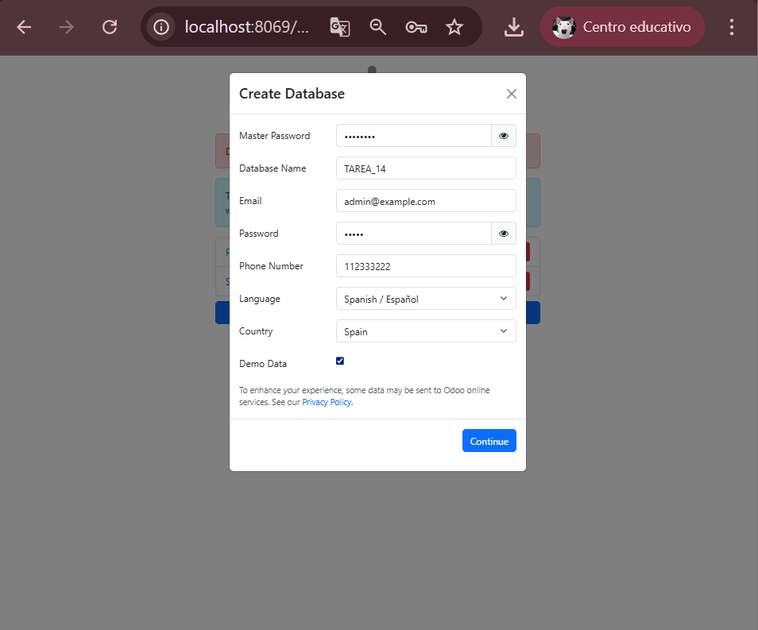
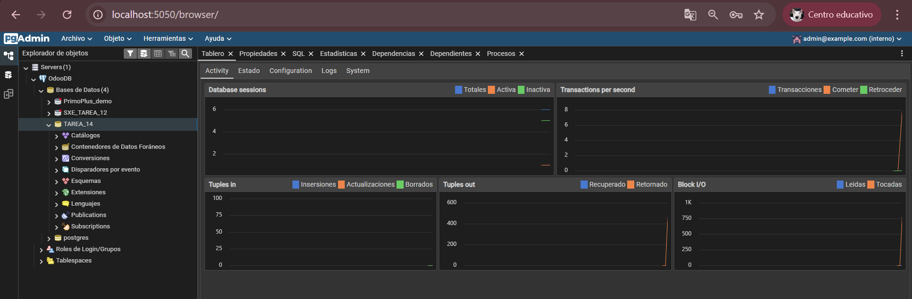
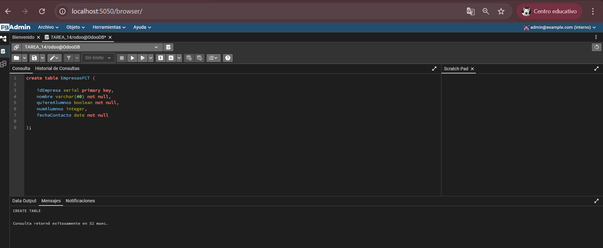
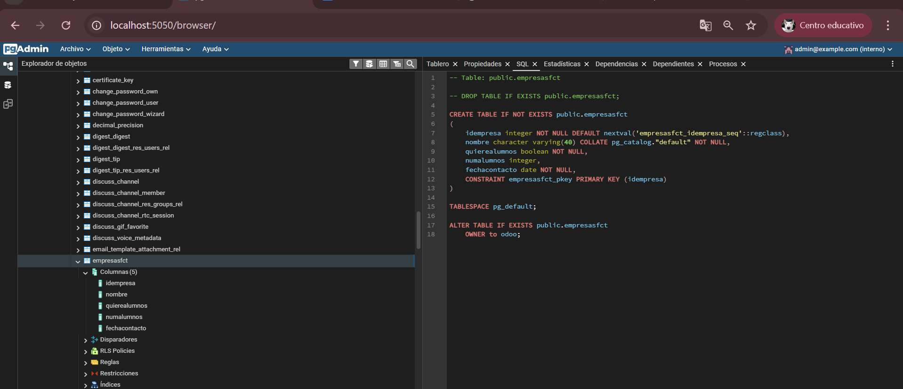
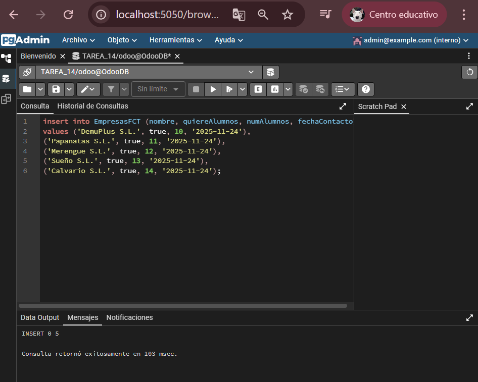
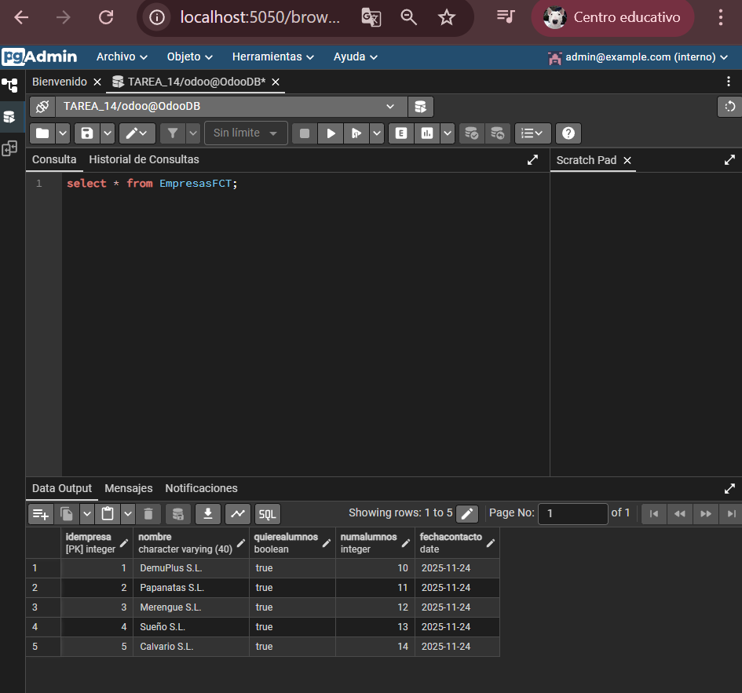
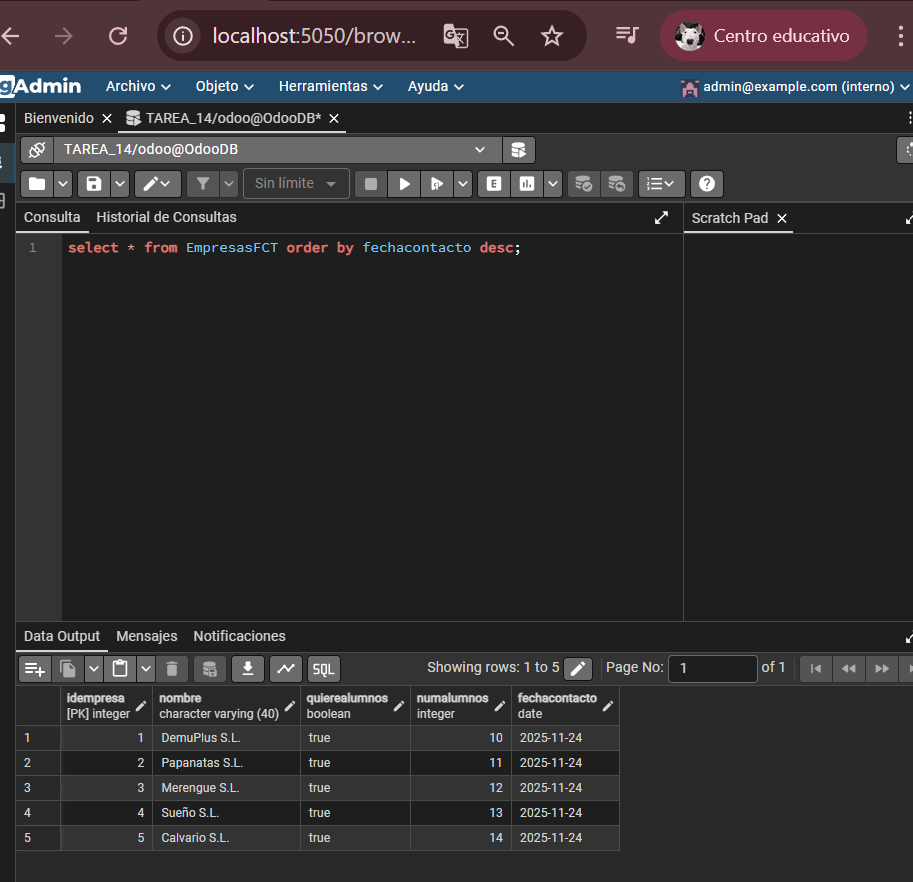
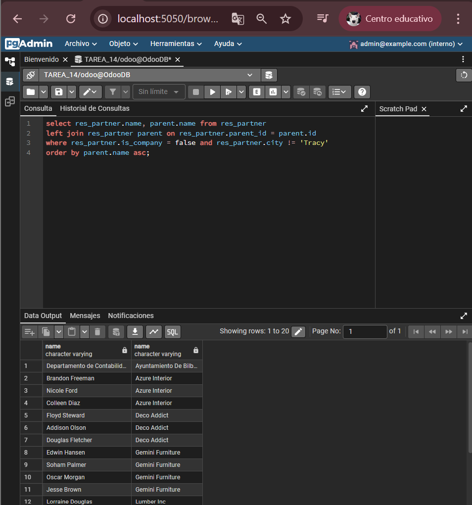
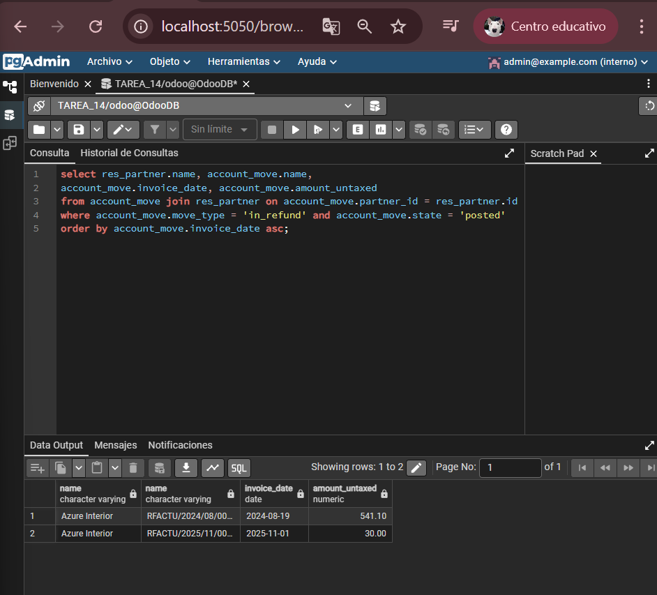
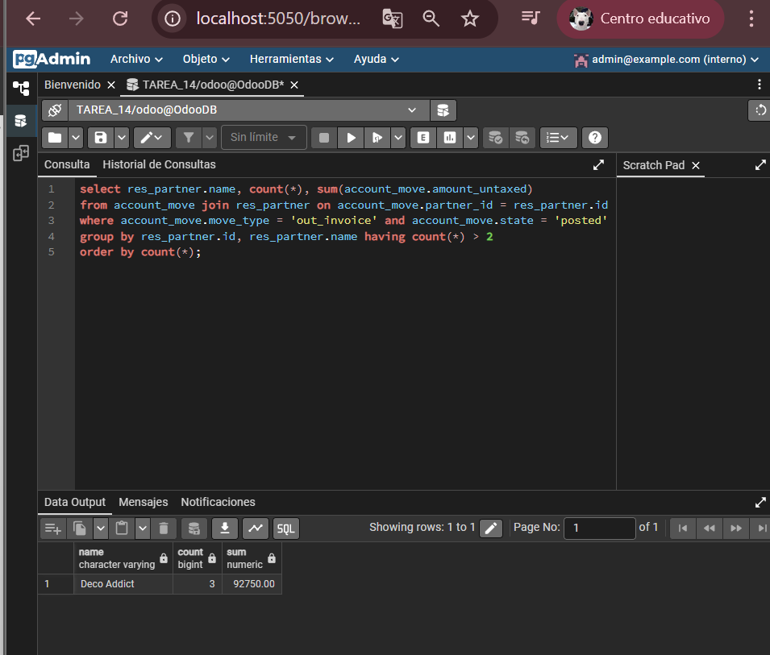

# TAREA 14 SXE 🧙‍♂️

### PRECONFIGURACIÓN 🎮

> **CREAMOS LA NUEVA BASE DE DATOS DE ODOO Y CONECTAMOS PGADMIN PARA REALIZAR LAS FUTURAS INSERCIONES 🦷** 

---

### EJERCICIO 1 🥷

> **REALIZAMOS LA INSERCIÓN SQL PARA GENERAR LA TABLA CON LOS VALORES INDICADOS EN EL ENUNCIADO 📎**

---

### EJERCICIO 2 🦫

> **REALIZAMOS 5 INSERTS CON SOLO UNA SENTENCIA SQL 👀**

---

### EJERCICIO 3 ️ 🦥

> **ORGANIZAMOS LA BUSCA CON UNA SENTENCIA QUE ORDENE SEGÚN LA FECHA MÁS RECIENTE ( hice las inserciones con la misma fecha pero bueno la sentencia está bien ) 🦍**

---

### EJERCICIO 4  🪽

> **RES_PARTNER ES LA TABLA PRINCIPAL DE CONTACTOS Y EMPRESAS EN ODOO, DONDE NAME ES EL NOMBRE, IS_COMPANY INDICA SI ES EMPRESA ( TRUE ) O CONTACTO ( FALSE ), PARENT_ID VINCULA UN CONTACTO A SU EMPRESA Y CITY ES LA CIUDAD 🦕**

---

### EJERCICIO 5 🦚

> **ACCOUNT_MOVE GUARDA FACTURAS Y REEMBOLSOS, MOVE_TYPE = 'IN_REFUND' SON REEMBOLSOS DE PROVEEDOR, STATE = 'POSTED' SIGNIFICA QUE ESTÁN VALIDADOS Y RES_PARTNER.NAME ES EL NOMBRE DEL PROVEEDOR. 🎰**

---

### EJERCICIO 6 🤹

> **MOVE_TYPE = 'OUT_INVOICE' SON FACTURAS DE CLIENTE, STATE = 'POSTED' SON FACTURAS CONFIRMADAS, GROUP BY + HAVING COUNT(*) > 2 FILTRA CLIENTES CON MÁS DE 2 FACTURAS, SUM(AMOUNT_UNTAXED) DA EL TOTAL SIN IMPUESTOS. 🦾**

